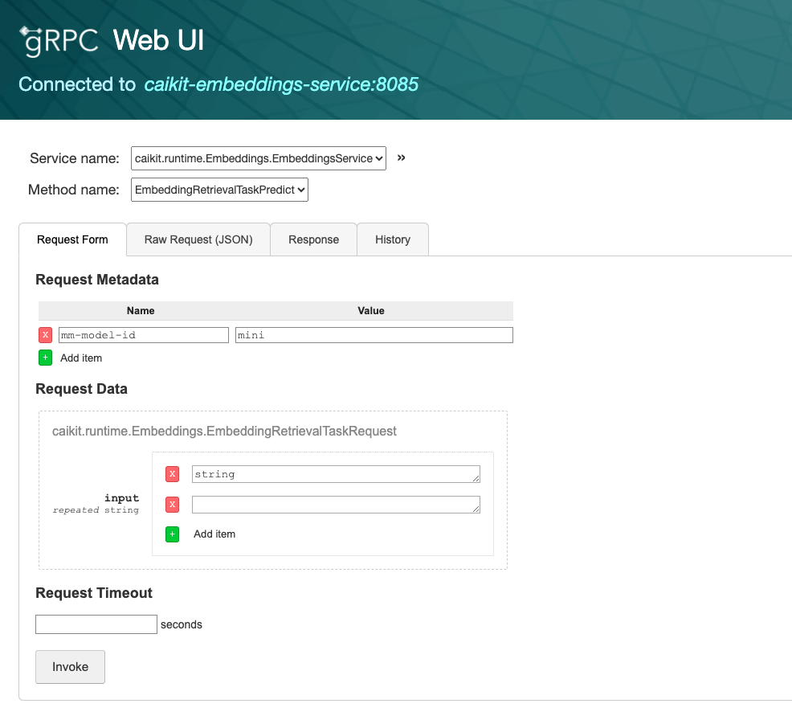
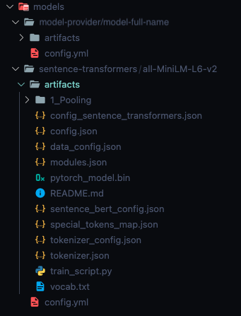

# Caikit Embeddings Deployment

Deployment config for caikit embeddings.

### Set the Image Pull secret

Copy credentials obtained from the container registry owner into environment variable
```bash
export ICR_APIKEY=<icr-credential>
```
Copy credential into secret and link to default service account
```bash
oc create secret docker-registry icr-caikit-image \
  --docker-server=icr.io --docker-username=iamapikey \
  --docker-password=${ICR_APIKEY} --docker-email=iamapikey
oc secrets link serviceaccount/default secrets/ icr-caikit-image --for=pull
```

### Add components to Helm repo
This pattern should be followed for every additional component
```bash
helm repo add bitnami https://charts.bitnami.com/bitnami 
helm repo update
helm dependency update
```

## Deploy the Service

1. Connect to OCP cluser and desired project or create new one, get the COS credentials and fill in the `.env`. Copy/create from the `.env-example` that has all variables' needed. 
```bash
export export $(cat .env | xargs)
``` 
2. Export the variable `MODEL_NAME` with the path of the main model, such as `sentence-transformers/all-minilm-l6-v2` or the desired model ID;
3. The run:
```bash
export MODEL_NAME=$(sed 's/\//\-/g' <<< "$MODEL_NAME")
```
If the model name has the dot character, eg. `all-minilm-l6-v2.23`, you need to also run:
```bash
export MODEL_NAME=$(sed 's/\./\-/g' <<< "$MODEL_NAME")
```
> This is needed for the naming convention of each of the models' deployments

And finally:
```bash
export FULL_NAME_OVERRIDE=caikit-embeddings-$MODEL_NAME
```
4. Then install the helm chart with:
```bash
cd charts
helm upgrade --install --history-max=2-n $OC_PROJECT_NAME --set secrets.cosAccesskey=$COS_ACCESS_KEY --set fullnameOverride=$FULL_NAME_OVERRIDE secrets.cosSecretkey=$COS_SECRET_KEY —set $HELM_NAME .
``` 

## Conditional GPU Allocation

The code for enabling GPU resource usage for sentence-transformers already handles the cuda/cpu selection automatically [SentenceTransformer.py](https://github.com/UKPLab/sentence-transformers/blob/master/sentence_transformers/SentenceTransformer.py#L104). However, the following configuration needs to be added to the [deployment-caikit-embeddings.yaml](./deployment-caikit-embeddings.yaml).

```yaml
  resources:
    limits:
      nvidia.com/gpu: "1"
```
Under `spec > spec > container > resources`, the above lines provide the GPU availability in cluster to be allocated.

## Enabling the gRPC UI for the service

1. Add another port to the current deployed service to expose the gRPC one:
```yaml
  ports:
    - name: server-port
      protocol: TCP
      port: 8080
      targetPort: 8080
    - name: grpc-port
      protocol: TCP
      port: 8085
      targetPort: 8085
```
2. Create a deployment using the file [deployment-caikit-emb-grpc-ui.yaml](./deployment-files/deployment-caikit-emb-grpc-ui.yaml).

```bash
oc apply -f deployment-caikit-emb-grpc-ui.yaml
```
This will create the deployment, service and route to access the gRPC at the browser. 

### For TLS enablement check the documentation at [deployment/tls-enablement](./tls-enablement/README.md).

> Remember to check if the host passed as parameters in `spec > containers > args` on the gRPC UI deployment has the same name as the caikit embeddings service.

Opening the route created, you should be able to see this view:


## Onboarding models

- The `demo/models` folder is now a PVC monted, that points to a bucket named `caikit-embeddings-models-config`;
> PVC yaml can be found at [pvc-models.yaml](pvc-models.yaml)
- Each user of the service can upload the models they wish to use, as long as they follow the same structure as before.
- See the image bellow to check how the bucket structure convention must be:
  
<center>
    
</center>

- Under the `model-full-name` dir there must be `artifacts` to where the `MODELS_LIST` will be pointed to, and `config.yaml` file in which the key `artifacts_path` must also point to the `artifacts` folder of the model.